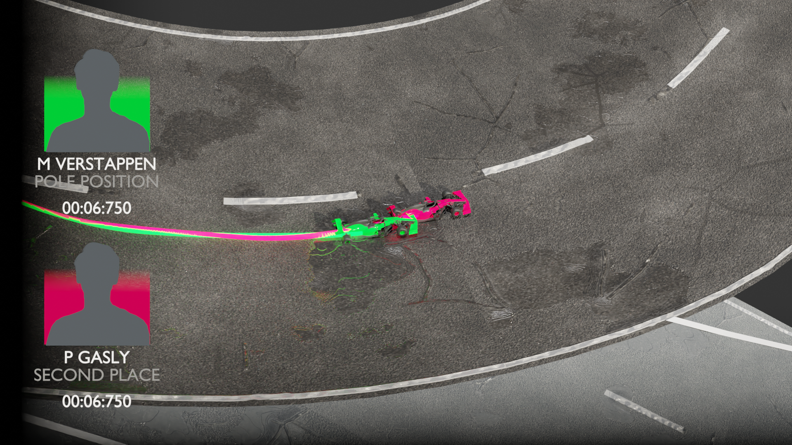

# Blender FastF1 Plugin README

Welcome to the FastF1 Blender Plugin, a Python-based utility leveraging the FastF1 library. The core functionality revolves around the user selecting a specific Formula 1 race year, track, driver, and specific lap to animate. This README will guide you through the process step-by-step.

---

## Table of Contents
1. [Plugin Installation](#plugin-installation)
2. [Plugin Overview](#plugin-overview)
3. [How to Use](#how-to-use)
4. [Warnings and Recommendations](#warnings-and-recommendations)
5. [Rendering](#rendering)

---

## Plugin Installation

To install the FastF1 Blender Plugin, follow the steps below:

1. Open Blender. In the top menu, navigate to Edit -> Preferences.

    

2. In the Preferences window, switch to the "Add-ons" tab.

    

3. Click "Install...".

    

4. Navigate to the location of the FastF1 Blender Plugin zip archive on your system, select it, and click "Install Add-on".

    

The first installation might take some time as the necessary libraries need to be loaded. If you wish to visualize the process of the first installation, it's advised to enable the Blender Console.

---

## Plugin Overview

With this plugin, you can animate Formula 1 laps based on real data. Select the race year, track, and driver. Assign them the desired color and choose which lap to animate. Upon animation generation, the plugin will provide you with a vivid representation of the lap's details.

---

## How to Use

### Step 1: Choose the Race Year

Select the year of the race you are interested in from the provided options.

### Step 2: Choose the Track (Event)

Select the track for the race from the provided options. Note: due to 3D model availability, it's recommended to choose Brazil.

### Step 3: Choose the Session - Always "Race"

For this plugin, always choose "Race" as the session type.

### Step 4: Load Session Data

Click "Load Session Data". Wait for the data to load. This may take a few moments.

### Step 5: Choose a Driver

Once the data is loaded, choose a driver from the list.

### Step 6: Color Selection

Assign the chosen driver a color for representation in the animation.

### Step 7: Choose the Lap

Choose a specific lap you want to animate. It's recommended to animate one lap at a time.

### Step 8: Animate

Press the "Animate Drivers" button and wait for the process to complete. If you wish to monitor the animation generation, it's advised to enable the Blender Console before starting the process.

### Step 9: Review the Animation

Once the animation generation process is completed, you can review the animation by pressing num 0 to switch to camera view and space to start the animation.

---

## Warnings and Recommendations

- Real-time animation requires a powerful processor, on weaker systems, the animation might play frame-by-frame.
- It is advisable to animate individual laps instead of all laps at once, to save time.
- Only Brazil track is available for selection due to 3D model availability.
- It is recommended to mark events with different colors and to avoid animating more than two drivers at once.
- If animating the first lap, be aware that the first minute's data may be missing, and the car may not be present on the track during that time.

---

## Rendering

After setting up your animation, it's time to render:

1. In the top menu, go to Render -> Render Image, or press F12. 
2. To use the Cycles render engine, go to the "Render Properties" panel, and from the "Render Engine" drop-down list, choose "Cycles".
3. To choose the path for the render output, go to the "Output Properties" panel, and under "Output", select your desired path.
4. Adjust the render dimensions under "Dimensions" in the "Output Properties" panel. You can also select the render quality here.
5. If you wish to render a video instead of an image sequence, under the "Output" section in the "Output Properties" panel, select the desired video file format from the "File Format" drop-down menu.

After all settings are configured, simply press F12 to start rendering, and wait for the final result.

---

Enjoy your Formula 1 animation journey!
